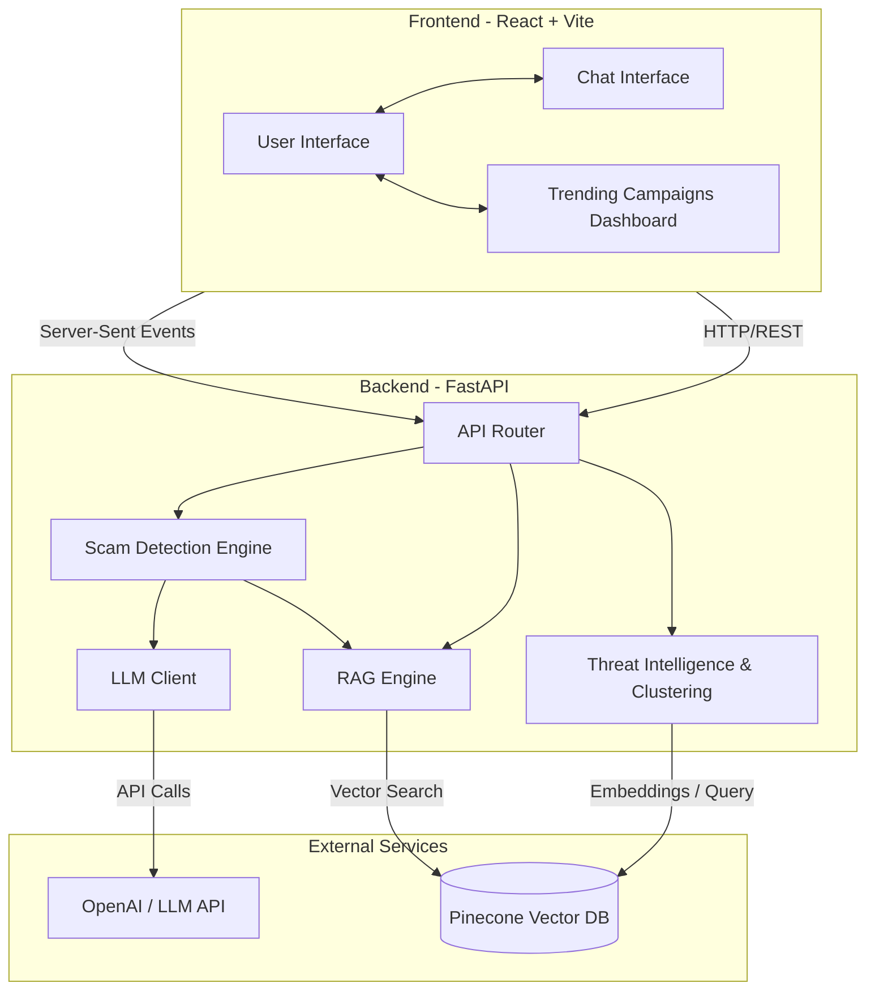

# Scam Shield - AI-Powered Digital Fraud Detection 🛡️

Scam Shield (formerly known as Citizen Fraud Shield) is an intelligent, real-time web application designed to protect users from digital scams, fraud, and digital arrest schemes. By simply pasting suspicious messages, emails, or chat transcripts into the app, users receive an instant verdict on whether the communication is a scam, along with a detailed explanation, confidence score, and specific red flags identified in the text. 

The application doesn't stop at classification; it features an interactive AI assistant that allows users to ask follow-up questions, get guidance on what to do next, and view live, trending scam campaigns happening in the community. 

Under the hood, Scam Shield leverages cutting-edge LLMs (OpenAI), RAG (Retrieval-Augmented Generation) for up-to-date scam knowledge, and a vector database (Pinecone) to cluster cross-user submissions and identify emerging fraud campaigns in real time.

---

## 🏗️ Architecture

The system uses a modern client-server architecture with heavy reliance on external AI and vector database services for intelligence.



---

## ✨ Features

- **Real-Time Scam Analysis**: Paste any text and get an immediate classification (Scam, Suspicious, or Safe) along with actionable advice.
- **Interactive Chat Assistant**: Have a conversation with the AI about the scam. Ask follow-up questions like "Should I block this number?" or "What if I already clicked the link?".
- **Threat Intelligence (Trending Campaigns)**: Aggregates and clusters anonymous submissions in real-time using Vector DB embeddings to warn users about emerging, widespread scams.
- **RAG-Powered Knowledge**: Utilizes Retrieval-Augmented Generation to reference a database of known scam tactics and historical fraud data, ensuring highly accurate verdicts.
- **Beautiful & Modern UI**: A sleek, dark-themed, glassmorphism interface built with React and Tailwind CSS.

---

## 💻 Tech Stack

### Frontend
- **Framework**: React 19 + Vite
- **Styling**: Tailwind CSS v4
- **Architecture**: Component-based UI with interactive chat and real-time trending updates.

### Backend
- **Framework**: FastAPI (Python)
- **AI/LLM Integration**: OpenAI API
- **Vector Database**: Pinecone (for RAG and Campaign Clustering)
- **Data Validation**: Pydantic

---

## 📂 Folder Structure

```text
scam-shield/
├── backend/                  # FastAPI Backend Application
│   ├── api/                  # API endpoints and routes (routes.py)
│   ├── data/                 # Raw data / Knowledge base files for RAG
│   ├── detection/            # Scam classification logic, rules, and prompts
│   ├── intelligence/         # Clustering & trending campaign detection
│   ├── llm/                  # OpenAI client wrappers
│   ├── rag/                  # RAG ingestion and vectorstore queries
│   ├── tests/                # Unit and integration tests
│   ├── main.py               # FastAPI application entry point
│   └── requirements.txt      # Python dependencies
│
├── frontend/                 # React Frontend Application
│   ├── public/               # Static assets
│   ├── src/                  # React source code
│   │   ├── api/              # API client for communicating with backend
│   │   ├── assets/           # UI assets, images, etc.
│   │   ├── components/       # Reusable React components (ChatWindow, VerdictCard, etc.)
│   │   ├── App.jsx           # Main application layout
│   │   ├── index.css         # Tailwind and custom CSS
│   │   └── main.jsx          # React DOM mounting point
│   ├── package.json          # Node.js dependencies
│   ├── vite.config.js        # Vite bundler configuration
│   └── eslint.config.js      # Linting setup
│
├── .gitignore                # Git ignore rules
└── README.md                 # Project documentation
```

---

## 🚀 Getting Started

### Prerequisites
- Python 3.9+
- Node.js 18+
- OpenAI API Key
- Pinecone API Key

### 1. Clone the repository
```bash
git clone <your-repo-url>
cd scam-shield
```

### 2. Backend Setup
Navigate to the backend directory and install dependencies:
```bash
cd backend
python -m venv venv
source venv/bin/activate  # On Windows use `venv\Scripts\activate`
pip install -r requirements.txt
```

Set up your environment variables by creating a `.env` file in the `backend/` directory:
```env
# Example .env
OPENAI_API_KEY=your_openai_api_key_here
PINECONE_API_KEY=your_pinecone_api_key_here
# Add any other required environment variables
```

Run the FastAPI server:
```bash
uvicorn main:app --reload
# Server will start at http://0.0.0.0:8000
```

### 3. Frontend Setup
Open a new terminal and navigate to the frontend directory:
```bash
cd frontend
npm install
```

Start the Vite development server:
```bash
npm run dev
# The UI will be accessible at http://localhost:5173
```

